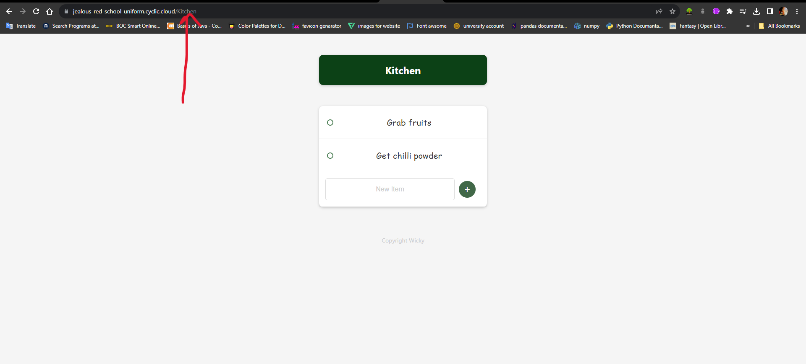
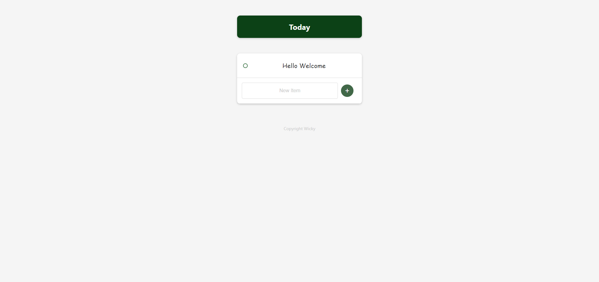
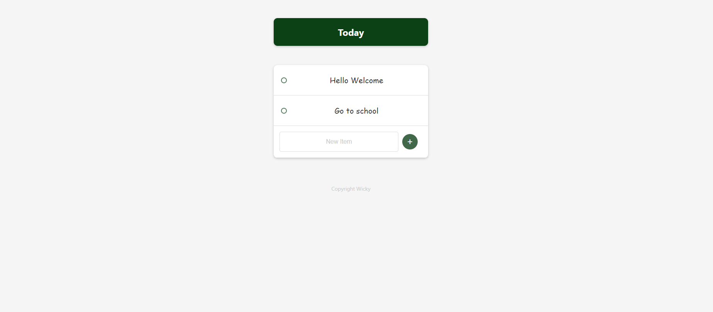

# Todo List v2

## Overview

This is a mini project for managing your to-do lists. You can access the main todo list on the [Home Page](https://jealous-red-school-uniform.cyclic.cloud). What makes this project special is its ability to create custom todo lists. You can create your own todo list by adding the todo list name to the end of the home URL.

For example, to access a custom todo list, use this URL format:

- Custom todo list: `https://jealous-red-school-uniform.cyclic.cloud/<custom-todo-list-name>`

The project allows you to add and remove items from your todo lists. It is built using various technologies such as Mongoose, MongoDB Atlas, JavaScript, Node.js, HTML, and CSS.

## Live Demo

You can explore the live demo of the project [here](https://jealous-red-school-uniform.cyclic.cloud).

## Features

- Create custom todo lists with unique names.
- Add and remove items from your todo lists.
- Access the main todo list on the [Home Page](https://jealous-red-school-uniform.cyclic.cloud).
- Easily manage your tasks in an organized way.

## Technologies Used

- **Mongoose**: A MongoDB object modeling library for Node.js.
- **MongoDB Atlas**: A cloud-based MongoDB database service.
- **JavaScript**: The programming language used for client-side scripting.
- **Node.js**: A JavaScript runtime for server-side development.
- **HTML**: The markup language used for creating web pages.
- **CSS**: The stylesheet language used for styling web pages.

## Usage

1. Access the main todo list on the [Home Page](https://jealous-red-school-uniform.cyclic.cloud).
2. Create custom todo lists by appending the desired name to the URL.
3. Add and remove items from your todo lists as needed.

## Screenshots

Here are some screenshots of the project:

## Getting Started

To run this project locally, follow these steps:

1. Clone this repository.
2. Install the necessary dependencies.
3. Configure MongoDB Atlas credentials.
4. Run the Node.js server.
5. Access the application in your web browser.
